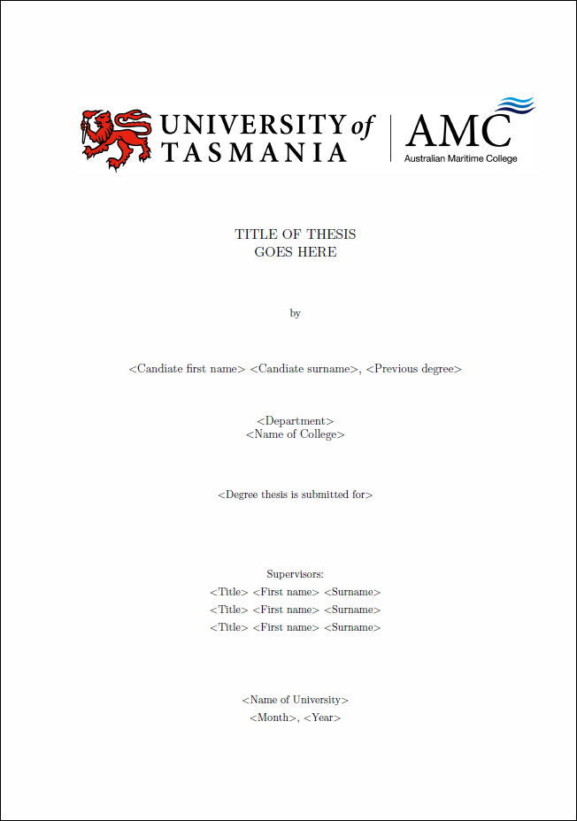

## LaTeX-AMC-PhD-Thesis-Template

LaTeX thesis template for University of Tasmania (UTas) Master or PhD thesis. The thesis template is based on the [University of Tasmania Mathematics Style File and Thesis Template for LaTeX](http://staff.acecrc.org.au/~mdsumner/TCallaghan/) by Tim Callaghan. The original University of Tasmania Mathematics LaTeX template has been updated to follow the 2015 University of Tasmania (UTas) thesis guidelines.

---

### Table of Contents

* [1. Title Page](#1-title-page)
* [2. Required LaTeX Packages](#2-required-latex-packages)
* [3. Test BareBone Version of Template](#3-test-barebone-version-of-template)
* [4. LaTeX File Structure](#4-latex-file-structure)
* [5. Customise the Template](#5-customise-the-template)
* [6. Adding new Chapters and Appendices](#6-adding-new-chapters-and-appendices)
* [7. Sections and Subsections](#7-sections-and-subsections)
* [8. Update Nomenclature, BibTeX Database and Indexes](#8-update-nomenclature-bibtex-database-and-indexes)
  * [8.1 Nomenclature](#81-nomenclature)
  * [8.2 Change References/Bibliography Header Title](#82-change-referencesbibliography-header-title)
  * [8.3 Basic teps to create an index for the document](#83-basic-steps-to-create-an-index-for-the-document)
* [9. Required Software](#9-required-software)
* [10. Some Useful LaTeX Scripts](#10-some-useful-latex-scripts)
* [11. Useful Online Tools](#11-useful-online-tools)
* [12. Other Useful Links](#12-other-useful-links)
* [13. License](#13-license)

---

### 1. Title Page



An example PDF of the LaTeX thesis template is availabe [here](raw/master/thesis.pdf).

---

### 2. Required LaTeX Packages

The following LaTeX packages have to be installed for the thesis template to work:

* [array](https://www.ctan.org/pkg/array) for extending the array and tabular environments
* [biblatex](https://www.ctan.org/pkg/biblatex) for bibliographies in LaTeX using BibTeX for sorting only
* [booktabs](https://www.ctan.org/pkg/booktabs) for publication quality tables in LaTeX
* [caption](https://www.ctan.org/pkg/caption) for customising captions in floating environments
* [color](https://www.ctan.org/pkg/color) for colour control for LaTeX documents
* [epstopdf](https://www.ctan.org/pkg/epstopdf) to convert EPS to encapsulated PDF using Ghostscript
* [etoolbox](https://www.ctan.org/pkg/etoolbox) as eTeX toolbox for LaTeX
* [fancyhdr](https://www.ctan.org/pkg/fancyhdr) for extensive control of page headers and footers in LaTeX
* [filecontents](https://www.ctan.org/pkg/filecontents) for extended filecontents and filecontents* environments
* [fixltx2e](https://www.ctan.org/pkg/booktabs) for LaTeX patches
* [float](https://www.ctan.org/pkg/float) for improved interface for floating objects
* [graphicx](https://www.ctan.org/pkg/graphicx) for graphics manipulation
* [hyperref](https://www.ctan.org/pkg/hyperref) for extensive support for hypertext in LaTeX
* [lipsum](https://www.ctan.org/pkg/lipsum) for easy access to the Lorem Ipsum dummy text
* [makeidx](https://www.ctan.org/pkg/makeidx) as standard LaTeX package for creating indexes
* [mathtools](https://www.ctan.org/pkg/mathtools) for mathematical tools to use with amsmath
* [nomencl](https://www.ctan.org/pkg/nomencl) for lists of symbols
* [ragged2e](https://www.ctan.org/pkg/ragged2e) for alternative versions of ragged-type comamands
* [sectsty](https://www.ctan.org/pkg/sectsty) to control sectional headers
* [showlabels](https://www.ctan.org/pkg/showlabels) to show label commands in the margin
* [siunitx](https://www.ctan.org/pkg/siunitx) for a comprehensive (SI) units package
* [tocbibind](https://www.ctan.org/pkg/tocbibind) to add bibliography/index/contents to Table of Contents (TOC)
* [xcolor](https://www.ctan.org/pkg/xcolor) for driver-independent color extensions for LaTeX and pdfLaTeX

All above mentioned LaTeX packages are available for download on the Comprehensive TeX Archive Network (CTAN), but packages can also be installed by using package managers included in TeX environments such as the MikTeX [package manager](http://docs.miktex.org/2.9/manual/pkgmgt.html).

---

### 3. Test BareBone Version of Template

First steps:

* Download and install [MiKTeX](http://miktex.org/) or other TeX framework (e.g. MacTeX, etc.)
* Download/clone __LaTeX-AMC-PhD-Thesis-Template__ repository

The following commands have to be executed in a terminal (e.g. Linux command terminal, Git Bash, DOS prompt, etc.) in the GitHub project directory (i.e. `\{path}\LaTeX-AMC-PhD-Thesis-Template`):

__>>__ Run LaTeX on thesis.tex:
```
$ latex thesis.tex
```
__>>__ Run BibTeX on thesis.tex:
```
$ bibtex thesis
```
__>>__ Run MakeIndex on thesis.idx (note the different file extension):
```
$ makeindex thesis
```
__>>__ Run LaTeX again on thesis.tex:
```
$ latex thesis
```
__>>__ Run LaTeX once more on thesis.tex:
```
$ latex thesis
```

For easier creation of the template use a LaTeX editor such as [Texmaker](http://www.xm1math.net/texmaker/), [TeXstudio](http://www.texstudio.org/), [TeXnicCenter](http://www.texniccenter.org/) or [LyX](http://www.lyx.org/) (see Required Software below).

---

### 4. LaTeX File Structure

The breakdown of the LaTeX file structure is as follows:

```
+--- Appendices
¦       app0.tex
¦       app1.tex
¦       app2.tex
¦       app3.tex
¦       app4.tex
¦       app5.tex
¦       app6.tex
¦       app7.tex
+--- Chapters
¦       Chapter1
¦          chap1.tex
¦          sect11.tex
¦          sect12.tex
¦          sect13.tex
¦          sect14.tex
¦       Chapter2
¦          chap2.tex
¦          sect21.tex
¦          sect22.tex
¦          sect23.tex
¦       Chapter3
¦          chap3.tex
¦          sect31.tex
¦          sect32.tex
¦          sect33.tex
¦       Chapter4
¦          chap4.tex
¦          sect41.tex
¦          sect42.tex
¦          sect43.tex
¦       Chapter5
¦          chap5.tex
¦          sect51.tex
¦          sect52.tex
¦          sect53.tex
¦       Chapter6
¦          chap6.tex
¦          sect61.tex
¦          sect62.tex
¦          sect63.tex
¦       Chapter7
¦          chap7.tex
¦          sect71.tex
¦          sect72.tex
¦          sect73.tex
+--- Figures
¦       Appendices
¦          placeholder.jpg
¦       Chapter_1
¦          placeholder.jpg
¦       Chapter_2
¦          placeholder.jpg
¦       Chapter_3
¦          placeholder.jpg
¦       Chapter_4
¦          placeholder.jpg
¦       Chapter_5
¦          placeholder.jpg
¦       Chapter_6
¦          placeholder.jpg
¦       Chapter_7
¦          placeholder.jpg
¦       University_of_Tasmania_AMC_Logo_RGB.jpg
+--- Frontbackmatter
¦       index.tex
¦       newcom.tex
¦       prelude.tex
+--- Nomenclature
¦       nomenclature.tex
+--- Packages
¦       mathphdthesis.sty
¦       sectsty.sty
¦       tocbibind.sty
+--- References
¦       thesis.bib
¦   biby.tex
¦   index.tex
¦   LICENSE
¦   README.md
¦   thesis.pdf
¦   thesis.tex 
```

Where content of folders are as follows:

| Folder name         | Folder contents                                             |
| ------------------- | ----------------------------------------------------------- |
| __Appendices__      | Thesis appendices, each in its separate `appX.tex` file.    |
| __Chapters__        | Thesis chapters, each in its separate `chapX.tex` file.     |
| __Figures__         | Figures, plots, etc. as PDF or EPS files.                   |
| __Frontbackmatter__ | Prelude, abstract, acknowledgements, etc.                   |
| __Packages__        | Style (`*.sty`) files and custom LaTeX packages.            |
| __References__      | BibTeX (`*.bib`) database file as referenced in `biby.tex`. |

---

### 5. Customise the Template

To customise it for you personally, the file that you will need to edit is `prelude.tex`. If you have a look in this file you will see the following lines:

```latex
\title{Title of thesis\\goes here}					% Thesis title
\author{<Candiate first name> <Candiate surname>} 	% First name and surname of candidate (e.g. John Doe)
\prevdegrees{<Previous degree>}              		% Specify your previous degrees (e.g. B.E. (Hons))
\institute{<Department>}							% Institute of department (e.g. National Centre for Maritime Engineering and Hydrodynamics)
\college{<Name of College>}							% Name of college (e.g. Australian Maritime College)
\submittedfor{<Degree thesis is submitted for>}		% Degree thesis is submitted for (e.g. Submitted in fulfillment of the requirements for the Degree of Doctor of Philosophy)
\advisor{<Title> <First name> <Surname>\\ <Title> <First name> <Surname>\\ <Title> <First name> <Surname>} % Supervisors: (e.g. Prof. Lawrence K. Forbes)
\dept{<Name of University>}   					    % Your academic department (e.g. University of Tasmania)
\submitdate{<Month>, <Year>}						% Month & year of your thesis submission (e.g. January, 2016)
```

To edit text change the content between the __{}__ braces. 

To enable/disable parts of the template (i.e. copyright page, list of tables, list of figures, etc.) use the variables stated at the very top of the `prelude.tex` file. 

```latex
\titlepgtrue	     % Main title page (required)
\signaturepagetrue   % Page for declaration of originality (required)
\copyrighttrue 		 % Copyright page (required)
\abswithesistrue 	 % Abstract to be bound with thesis (optional)
\acktrue 			 % Acknowledgements page (optional)
\tablecontentstrue 	 % Table of contents page (required)
\tablespagetrue 	 % Table of contents page for tables (required only if you have tables)
\figurespagetrue 	 % Table of contents page for figures (required only if you have figures)
```
 
These are flags that specify which elements of the preface  you want to generate. By default all the commands are set to `true`, which means it will include everything but if you don't want to include something you can change 
the `true` to `false` at the end of the command name. 

---

### 6. Adding new Chapters and Appendices

To create new chapters and appendices:

* __For a new Appendix:__ Create a new `appX.tex` file in __Appendices__ folder where __X__ stands for the appendix number (e.g. `app5.tex` or `app6.tex`).
* __For a new Chapter:__ Create a new `chapX.tex` file in __Chapters__ folder where __X__ stands for the chapter number (e.g. `chap5.tex` or `chap6.tex`).

For a basic section, subsection structure of the new chapter or appendix the example template files `chapter.tex` and `appendix.tex`, located in the __Templates__, can be used. Then open file `thesis.tex` and add a new reference to the new chapter or appendix file in the LaTeX code at the end of the file:

```latex
% Specify which pieces (other .tex files) you plan to include. You can comment
% out files that you will include later or have already finished to speed
% up TeX processing
\includeonly{
Frontbackmatter/prelude 	% Contains all the relevant candidate information (name, degrees, abstract etc)
,Frontbackmatter/newcom 	% Place all you new commands in here
,Nomenclature/nomenclature  % The nomenclature chapter
,Chapters/Chapter1/chap1  	% The first chapter
,Chapters/Chapter2/chap2  	% The second chapter
,Chapters/Chapter3/chap3  	% The thrid chapter
,Chapters/Chapter4/chap4  	% The fourth chapter
,Chapters/Chapter5/chap5  	% The fifth chapter
,Chapters/Chapter6/chap6  	% The sixtth chapter
,Chapters/Chapter7/chap7  	% The seventh chapter
,Appendices/app0   			% Needed to switch to appendix mode
,Appendices/app1   			% Appendix A
,Appendices/app2   			% Appendix B
,Appendices/app3   			% Appendix C
,Appendices/app4   			% Appendix D
,Appendices/app5   			% Appendix E
,Appendices/app6   			% Appendix F
,Appendices/app7   			% Appendix G
,index  					% Places the index in the thesis
}
```

as well as in:

```latex
% Include all the pieces of your thesis in here
\include{Frontbackmatter/prelude}
\include{Frontbackmatter/newcom}
\include{Nomenclature/nomenclature}
\include{Chapters/Chapter1/chap1}
\include{Chapters/Chapter2/chap2}
\include{Chapters/Chapter3/chap3}
\include{Chapters/Chapter4/chap4}
\include{Chapters/Chapter5/chap5}
\include{Chapters/Chapter6/chap6}
\include{Chapters/Chapter7/chap7}
\include{Appendices/app0}
\include{Appendices/app1}
\include{Appendices/app2}
\include{Appendices/app3}
\include{Appendices/app4}
\include{Appendices/app5}
\include{Appendices/app6}
\include{Appendices/app7}
\include{index}
```

---

### 7. Sections and Subsections

Sections of chapters (i.e. 1.1, 1.2, 1.3, etc.) have been placed in their own `*.tex` file to allow easier access to the content and shorten the individual chapter files. The sections files (e.g. 1.1, 1.2, 1.3, etc.) are then included using `\input{section_file}` in the main chapter files (i.e. `chap1.tex`, `chap2.tex`, `chap3.tex`, etc.). This principle is shown for Chapter 1 below but this method applies to all the other chapters as well:

```latex
%% CHAPTER HEADER /////////////////////////////////////////////////////////////////////////////////////
\chapter[Figures, Equations, Tables, and Referencing]{Figures, Equations, Tables, and Referencing}
\label{ch1}

%% CHAPTER INTRODUCTION ///////////////////////////////////////////////////////////////////////////////

\lipsum[1]

%% INCLUDE SECTIONS ///////////////////////////////////////////////////////////////////////////////////

\input{Chapters/Chapter1/sect11}
\input{Chapters/Chapter1/sect12}
\input{Chapters/Chapter1/sect13}
\input{Chapters/Chapter1/sect14}
```

The __CHAPTER INTRODUCTION__ contains the introduction text for the chapter, the inputs (see below) contain the content for sections __1.1__, __1.2__, __1.3__, and __1.4__:

```latex
\input{Chapters/Chapter1/sect11}
\input{Chapters/Chapter1/sect12}
\input{Chapters/Chapter1/sect13}
\input{Chapters/Chapter1/sect14}
```

Subsections can be added to the section files (i.e. `Chapters/Chapter1/sect11`, etc.) using the following code shown for example subsection __1.1.1__ which would be added to `Chapters/Chapter1/sect11`:

```latex
%% SUBSECTION HEADER //////////////////////////////////////////////////////////////////////////////////
\subsection{Subsubsection}
\label{sec111}
```

Examples for subsections are shown in:
* `\Chapters\Chapter2\sect21.tex` showing subsections __2.1.1__, __2.1.2__, and __2.1.3__
* `\Chapters\Chapter2\sect22.tex` showing subsections __2.2.1__, __2.2.2__, and __2.2.3__
* `\Chapters\Chapter2\sect23.tex` showing subsections __2.3.1__, __2.3.2__, and __2.3.3__

---

### 8. Update Nomenclature, BibTeX Database and Indexes

To update the BibTeX database and LaTeX document, a few commands need to be executed from the command line (i.e. Linux terminal window, DOS command window, Git Base, etc.) in the base repository directory:

Update the __BibTeX__ database using the command:
```
$ BibTeX thesis
```
To make the changes effective the LaTeX document has to be rebuilt either using the command:
```
$ latex thesis
```
or the build command of the IDE used to create the LaTeX document.

#### 8.1 Nomenclature

The nomenclature LaTeX file is located here:

```
+--- Nomenclature
¦       nomenclature.tex
```

To rebuild the nomenclature after changes have been made use the following command using either a terminal or DOS command window:

```
$ makeindex thesis.nlo -s nomencl.ist -o thesis.nls
```

After the nomenclature file was rebuilt using the above command, the thesis PDF file has to be rebuilt by either uisng the build command in a LaTeX editor or by using command line:

```
$ latex thesis
```

Styling of the nomenclature is based on a tutorial found on [TeX StackeEchange](http://tex.stackexchange.com/questions/112884/how-to-achieve-nomenclature-entries-like-symbol-description-dimension-and-uni) which allows to the nomenclature to be broken down into the following sections:

__Dimensionless numbers__
```latex
\nomtypeG{\( \varepsilon_0 \)}{vacuum permittivity}{F/L}{\si{F.m^{-1}}}
```

__Greek symbols__
```latex
\nomtypeD{\( \mathcal A_r \)}{Archimedes number}{\(\displaystyle
\frac{d^3g\rho_c\abs{\Delta\rho}}{\mu_c^2} = \sqrt{\frac{\mathcal
E_0^3}{\mathcal M_0}} \)}
```

__Roman symbols__
```latex
\nomtypeR[abc]{\(a,b,c\)}{half axes of ellipsoid}{L}{\si{m}}
\nomtypeR[C]{\(C\)}{dimensionless coefficient (e.g.\ for drag model)}{--}{1}
\nomtypeR[CC]{\(\mathbf{C}\)}{another dimensionless coefficient}{--}{1}
```

The styling commands can be found in `Packages/mathphdthesis.sty` and the nomenclature itself is included as a file in `thesis.tex`:

```latex
% Include all the pieces of your thesis in here
\include{Frontbackmatter/prelude}
\include{Frontbackmatter/newcom}
\include{Nomenclature/nomenclature} <<<=====
\include{Chapters/Chapter1/chap1}
\include{Chapters/Chapter2/chap2}
\include{Chapters/Chapter3/chap3}
\include{Chapters/Chapter4/chap4}
\include{Chapters/Chapter5/chap5}
\include{Chapters/Chapter6/chap6}
\include{Chapters/Chapter7/chap7}
\include{Appendices/app0}
\include{Appendices/app1}
\include{Appendices/app2}
\include{Appendices/app3}
\include{Appendices/app4}
\include{Appendices/app5}
\include{Appendices/app6}
\include{Appendices/app7}
\include{index}
```

The inclusion of the chapter title in the table of contents (TOC) is handled using the starred version of `\chapter` as shown [here](http://tex.stackexchange.com/questions/22905/one-chapter-without-numeration). The code that has been included in the file `Nomenclature/nomenclature.tex` for this purpose is:

```latex
\chapter*{NOMENCLATURE}
\addcontentsline{toc}{chapter}{NOMENCLATURE}
\label{nomenclature}
```

#### 8.2 Change References/Bibliography Header Title

The default header title used in the thesis template is __References/Bibliography__. This can be changed in `prelude.tex` by changing the title in the following code bit:

```latex
% Bibliography Title
\renewcommand{\bibname}{References/Bibliography}
```

#### 8.3 Basic steps to create an index for the document

The following index configuration details have already been included in the presented template (see `Packages/mathphdthesis.sty`).

Include the [makeidx package](http://www.tex.ac.uk/ctan/indexing/makeindex/doc/makeindex.pdf) using `\usepackage`. 

```latex
\usepackage{makeidx}
```

Put a `\makeindex` command in the document preamble.

```latex
\makeindex
```

Put a `\printindex` command where the index it to appear---usually at the end, before the \end{document} command.

```latex
\printindex
```

Steps that have to be taken by the user to create indexes are as follows:

__Example index:__

To create an index `Fourier Series` use the example shown in the text below:

```latex
To solve various problems in physics, it can be advantageous to express any arbitrary piecewise-smooth 
function as a Fourier Series \index{Fourier Series} composed of multiples of sine and cosine functions.
```

But there are more options which are documented here:

* [Wikibooks: LaTeX/Indexing](http://en.wikibooks.org/wiki/LaTeX/Indexing)
* [Cambridge University Press: Indexing In LaTeX](https://authornet.cambridge.org/information/productionguide/stm/indexing_in_latex.asp)
* [Tips on Indexing LATEX Documents](http://www.math.utah.edu/~beebe/talks/1998/idxtips.pdf)

To create an index, the following commands have to be executed:

1. Run LaTeX on your` .tex` file to generate a `.idx` file.
```
$ latex thesis
```
2. Run makeindex on `thesis.idx`.
```
$ makeindex thesis
```
3. Rerun LaTeX on your `.tex` file to create a document with an index.
```
$ latex thesis
```

---

### 9. Required Software

The template has been created using Windows based tools and TeX installs but there are many tools available for Mac OS, Linux, etc. but they will not be mentioned here.

* MiKTeX (Windows): [MiKTeX](http://miktex.org/)
* Editor: [TeXstudio](http://texstudio.sourceforge.net/)
* BibTeX Database Manager: [JabRef](http://jabref.sourceforge.net/), [Zotero](http://www.zotero.org/) or [Mendeley](http://www.mendeley.com/)
* Plotting: [GNUPlot](http://www.gnuplot.info/)
* Graphics: [TikZ and PGF](http://www.texample.net/tikz/)

Alternative TeX environments (for Mac OS X)

* MacTeX (Mac OS X): [MacTeX](https://tug.org/mactex/)

Alternative LaTeX editors:

* [Texmaker](http://www.xm1math.net/texmaker/)
* [TeXnicCenter](http://www.texniccenter.org/)
* [WinEdt](http://www.winedt.com/)
* [Sublime Text](http://www.sublimetext.com/) with [LaTeX Plugin](https://github.com/SublimeText/LaTeXTools#readme)
* [LyX](http://www.lyx.org/)
 
As more extensive list of editors can be found in this post here [StackExchange Post: LaTeX Editors/IDEs](http://tex.stackexchange.com/questions/339/latex-editors-ides).
 
---

### 10. Some Useful LaTeX Scripts

* [latexdiff](http://www.ctan.org/pkg/latexdiff)
* [biblatex](http://www.ctan.org/pkg/biblatex)
* [koma-script](http://www.ctan.org/pkg/koma-script)

---

### 11. Useful Online Tools

* [mathURL](http://mathurl.com/)
* [Table Editor 1](http://truben.no/latex/table/)
* [Table Editor 2](http://www.tablesgenerator.com/)
* [BibTeX Editor](http://truben.no/latex//)
* [latex-diff](http://3142.nl/latex-diff/)
* [Equation Editor](http://www.sciweavers.org/free-online-latex-equation-editor)

---

### 12. Other Useful Links

* [Using LATEX to Write a PhD Thesis](http://www.dickimaw-books.com/latex/thesis/thesis-report.pdf)
* [TeX: Stackexchange](http://tex.stackexchange.com/)
* [The not so Short Introduction to LaTeX](http://www.ctan.org/tex-archive/info/lshort/english/?action=/tex-archive/info/lshort/)
* [howtoTeX](http://www.howtotex.com/)
* [University of Cambridge: Text Processing using LaTeX](http://www-h.eng.cam.ac.uk/help/tpl/textprocessing/)
* [The Comprehensive LATEX Symbol List](http://ctan.unsw.edu.au/info/symbols/comprehensive/symbols-letter.pdf)
* [Strategies for including graphics in LATEX documents](http://www.tug.org/TUGboat/tb26-1/hoeppner.pdf)

---

### 13. License

This software is free and is covered under the MIT License, given here:

The MIT License (MIT)

Copyright (c) 2015 Konny Zürcher

Permission is hereby granted, free of charge, to any person obtaining a copy of this software and associated documentation files (the "Software"), to deal in the Software without restriction, including without limitation the rights to use, copy, modify, merge, publish, distribute, sublicense, and/or sell copies of the Software, and to permit persons to whom the Software is furnished to do so, subject to the following conditions:

The above copyright notice and this permission notice shall be included in all copies or substantial portions of the Software.

THE SOFTWARE IS PROVIDED "AS IS", WITHOUT WARRANTY OF ANY KIND, EXPRESS OR IMPLIED, INCLUDING BUT NOT LIMITED TO THE WARRANTIES OF MERCHANTABILITY, FITNESS FOR A PARTICULAR PURPOSE AND NONINFRINGEMENT. IN NO EVENT SHALL THE AUTHORS OR COPYRIGHT HOLDERS BE LIABLE FOR ANY CLAIM, DAMAGES OR OTHER LIABILITY, WHETHER IN AN ACTION OF CONTRACT, TORT OR OTHERWISE, ARISING FROM, OUT OF OR IN CONNECTION WITH THE SOFTWARE OR THE USE OR OTHER DEALINGS IN THE SOFTWARE.
